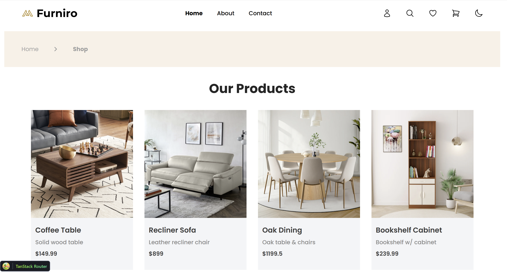

# React web application for a fictitious ecommerce

## 🛠️ Technical Features

- Programming language: Typescript

- Frontend Library: React.js

## 📁 Project Structure
- #### Components
  Contains .anim files and animation controllers that define how objects or characters animate over time.
- #### Hooks
  Holds custom React Hooks
- #### Routes
  Includes the page routes according to the Tanstack Router convenction.
- #### Schemas
  Contains the Zod Schemas/Models 
- #### Stores
  Holds the Zustand global states (stores).

## ✅ Implemented Features

- Home view for all products.
- Individual view to each product.
- Cart view.
- Checkout form.

## ✅ To-be Implemented Features

- User sign-in, login, and logout views.
- Change of theme: dark theme.

## 📸 Screenshots

### Home

### Individual Product

### Cart

### Checkout

