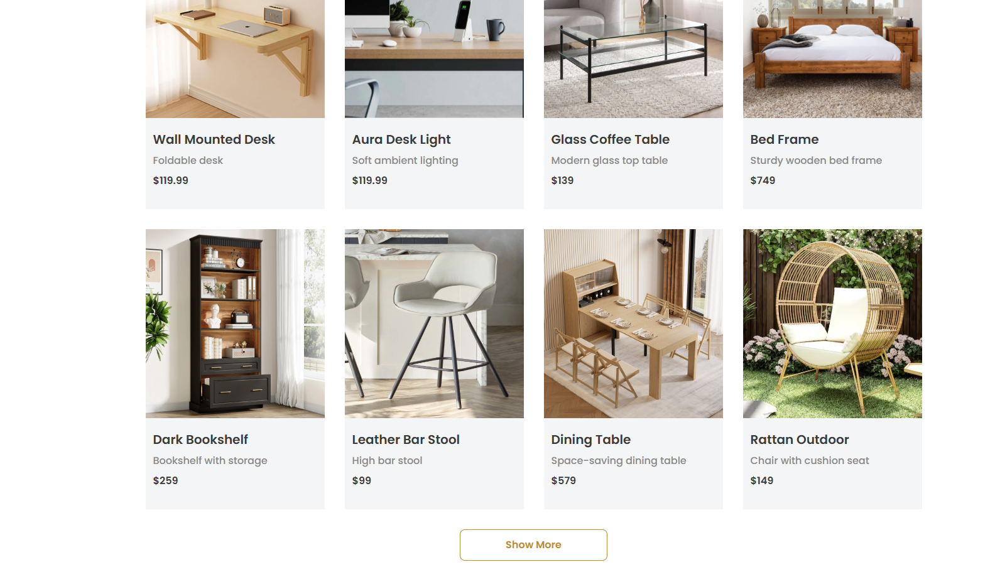
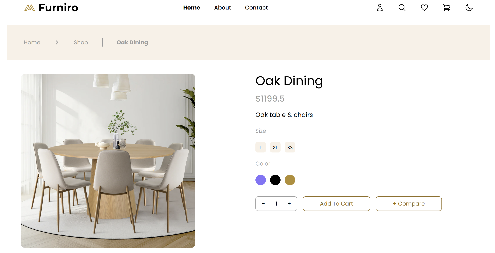
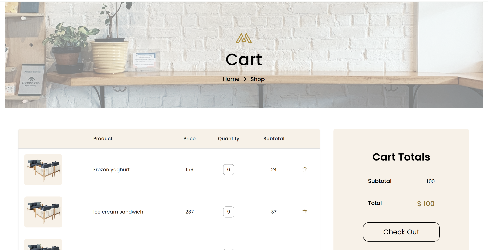

# React web application for a fictitious ecommerce

## 🛠️ Technical Features

- **Programming language:** TypeScript

- **Frontend library:** React.js

- **Routing system:** TanStack Router

- **Server state management:** TanStack Query

- **Global state management:** Zustand

- **Form management:** React Hook Form

- **Schema validation:** Zod

- **Styling frameworks:** Tailwind CSS

- **Animation library:** Framer Motion / Motion

- **Icon library:** FontAwesome

- **Notifications:** react-hot-toast

## 📁 Project Structure
- #### Components
  Contains reusable React components that define the UI and behavior of different parts of the application.
- #### Hooks
  Contains custom React hooks that encapsulate reusable logic and stateful behavior across the application.
- #### Routes
  Includes the application’s URL routes following the TanStack Router convention.
- #### Schemas
  Contains the Zod Schemas/Models
- #### Services
  Contains modules that handle API requests, business logic, and communication with external services or backend endpoints.
- #### Stores
  Holds the Zustand global states (stores).
- #### Utils/Components
  Contains shared utilities and small reusable UI components that can be used across different parts of the application.

## ✅ Implemented Features

- Home view displaying all products.
- Individual view to each product.
- Shopping cart with item management.
- Checkout form with type-safe validation using Zod schemas.
- Global state management using Zustand.
- Server state management with TanStack Query.
- Loading and error states for API requests.
- Route management with TanStack Router.
- Real-time product updates via SSE (Server-Sent Events).
- Persistent cart data using Zustand’s persist middleware.

## ✅ To-be Implemented Features

- User sign-in, login, and logout views.
- Change of theme: dark theme.

## 📸 Screenshots

### Home

### Individual Product

### Cart

### Checkout

